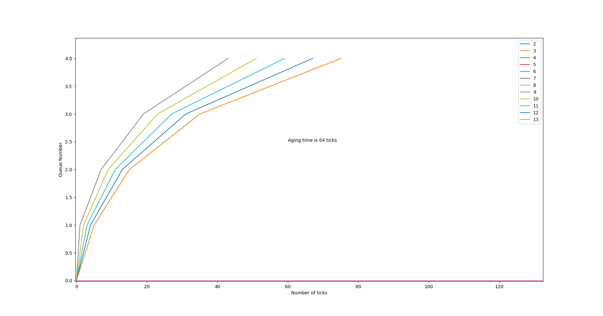

# Report of the assignment
This report explains the changes made my us in the given xv6 code. 

## Specification 1: System calls 
## System Call 1 : trace
- In the UPROGS secotion of Makefile $U/_strace\ is added.
- Added `sys_trace()` in kernel/sysproc.c that reads the syscall argument and calls the
`trace()` defined in proc.c with the argument
- `trace()` sets the `mask` field of the process struct
- Modified `fork()` to copy `mask` from parent to child
- Modified `syscall()` to print syscall info if the syscall is traced
- Created user program `strace` in user/strace.c that calls the trace system call to set the mask of the process and run the function passed.
## System Call 2 : sigalarm and sigreturn 
- modified `syscall.c` with 
- `extern uint64 sys_sigalarm(void);`
- `extern uint64 sys_sigreturn(void);`
- `[SYS_sigalarm]   sys_sigalarm`,
- `[SYS_sigreturn]   sys_sigreturn`
- This are the prototypes of the system calls. 
- modifies `syscall.h` added `sys_sigalarm` and `sys_sigreturn`
- `user.h` is modified added prototypes of functions 
- `usys.pl` is modified added entry entry("sigreturn") and entry("sigalarm")
- proc.h is added with the necessary fields like 
- all these added variable are initialized in allcoproc 
- `sys_sigalarm` is implemented in proc.c 
- if the process has a timer outstanding then expire the handler function. This is implemented in `trap.c.` 
- design the return function
- restore function and `sys_sigreturn` is implemented in `sys_proc.c `

## Specification 2: scheduling
- Modified Makefile to take argument which then defines a macro with the compiler to identify the scheduling algorithm
- SCHEDULER is the Macro which identifies which scheduling policy to implement
- `ifndef SCHEDULER`    
- `SCHEDULER:=RR`
- `endif`
- `CFLAGS+="-D$(SCHEDULER)"`

### a) FCFS Policy
- To store the time `struct proc` is edited.
- Edited `allocproc()` to initialise the new variable created above
- `void scheduler` is edited by using macro `FCFS`.
- Edited `kerneltrap()` in kernel/trap.c to disable premption with timer interrupts by disabling the yeild function 

### b) PBS Policy
- The required varibles to implement PBS are added in `proc.h` in  `struct proc`  `priority, time dispatched,`runtime during allocated time, and time when it ready to run
- Edited `allocproc()` to initialise the new variables created above
- Edited `scheduler()` to run the process with the highest priority in the section `ifdef PBS ... endif`
- Edited `clockintr()` to track runtime and wait time
- Added a new sycall `set_priority`  to manage the priority of different processes. 
  
### c) MLFQ Policy  
- Edited `struct proc` in `proc.c` to store the priority, allocated time, times dispatched, time added to queue, and time spent in each queue
- All the added variable is `struct proc` are initialized in `allocproc`
- Created 5 queues of different priority
- Implemented MLFQ in `scheduler` in `proc.c`.
- Edited `clockintr()` to track runtime, add processes to queue and handle aging
- Edited `kerneltrap()` and `usertrap()` to yield when process has exhausted its time slice

## Specification 3: Copy-on-write fork
- Modify uvmcopy() to map the parent's physical pages into the child, instead of allocating new pages. Clear PTE_W in the PTEs of both child and parent.
- Modify usertrap() to recognize page faults. When a page-fault occurs on a COW page, allocate a new page with kalloc(), copy the old page to the new page, and install the new page in the PTE with PTE_W set.
- Increase the ref_count in freerange() since freerange() will call kfree() and free() will decrease the count so we need to first increase then decrease.

## Additional Implementations
- `waitx()` syscall is implemented that functions similar to `wait()` but also returns the runtime and wait time of the child process
- In `clockintr()` `update_time ` is added to maintain the read and write time of the processes. 

- **Benchmarking**

  |         Scheduler         | rtime | wtime |
  | :-----------------------: | :-----: | :-----: |
  |        Round robin        |   11    |   144   |
  |  First come first serve   |   23    |   104   |
  | Priority based scheduler  |   11    |   145   |
  | Multilevel Feedback queue |   11    |   138   |

  The above results are obtained by running `schedulertest` on a single CPU.

  The below results are obtained by using 3 CPU.

  |         Scheduler         | rtime | wtime |
  | :-----------------------: | :-----: | :-----: |
  |        Round robin        |   9    |   110   |
  |  First come first serve   |   24    |   29   |
  | Priority based scheduler  |   7    |   112   |

<!-- ## Bonus
The following plot is obtained for cpu bound processes with the time limit for aging being 64 ticks

IO bound processes aren't included as they remain in queue 0 for the entire time. -->